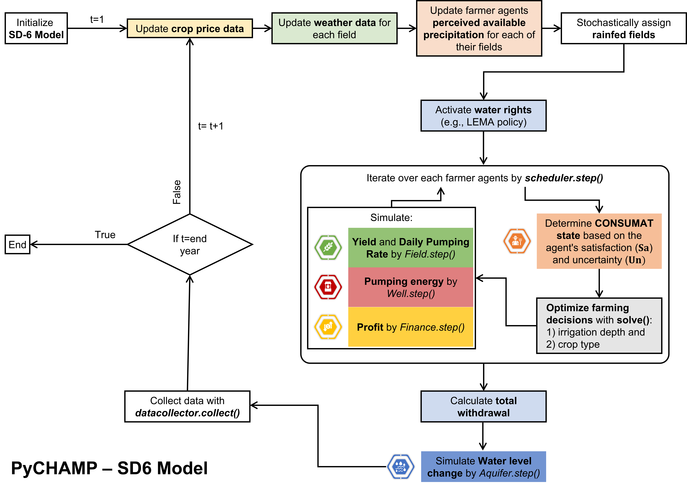
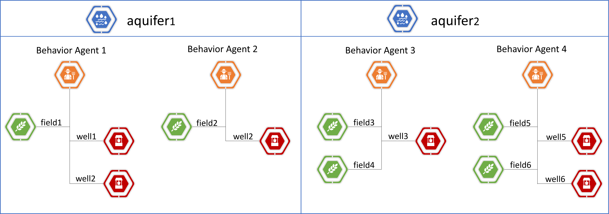

.. _example_SD6:  

Model Examples
###############

Sheriden 6 Local Enhanced Management Area Model (SD-6 Model)
==============================================================

Background of the Sheriden 6 Local Enhanced Management Area (SD-6 LEMA)
^^^^^^^^^^^^^^^^^^^^^^^^^^^^^^^^^^^^^^^^^^^^^^^^^^^^^^^^^^^^^^^^^^^^^^^^^

The SD-6 LEMA, launched in 2012, is a grassroots groundwater management initiative under the LEMA program within western Kansas's High Plains Aquifer region. With the objective of curtailing groundwater consumption by capping the water rights at 55 inches per unit area over a five-year period, SD-6 LEMA has completed two full cylces, first from 2013 to 2017 and subsequently from 2018 to 2022. Water use diminished by 33.6% in the first period and by 36.8% in the second. The upcoming section provides an overview of how PyCHAMP can model the complex interactions between human activities and water systems, employing SD-6 LEMA case study as an illustrative example. The article referenced has a detailed description of the background and the study area.

Lin, C. Y., Orduna Alegria, M., Dhakal, S., Zipper, S.,& Marston, L. (2024, in review). PyCHAMP: A crop‑hydrological‑agent modeling platform for groundwater management. Environmental Modelling & Software.

Setting up a complete simulation of the SD-6 model
^^^^^^^^^^^^^^^^^^^^^^^^^^^^^^^^^^^^^^^^^^^^^^^^^^^^^^^

Input Data and Model Structure
"""""""""""""""""""""""""""""""

SD-6 model, which is based on Mesa 2.1.1 framework, is set up utilizing aquifer, field, well, finance, and behavior classes described within this documentation. The required input data to initiate and run an SD-6 LEMA simulation with each farmer managing a single well and field are given in the table below.

.. csv-table:: Required inputs to run an SD-6 model simulation
   :file: dataForSimulation.csv
   :widths: auto
   :header-rows: 1

In this example, we validate the model's ability to capture agro-hydrological dynamics in a stakeholder-driver groundwater scheme by using observed data, which includes groundwater withdrawal, saturated thickness, and the types or proportions of crops grown in the fields.

.. csv-table:: Required observed data to validate model's ability to capture human-agricultural-hydrological dynamics
   :file: dataForMetricesCalc.csv
   :widths: auto
   :header-rows: 1

A process flow diagram is provided to illustrate the organized sequence of operations and the decision-making mechanisms of the farmer agents in the model.

   Simulation schema of the SD-6 Model, developed with PyCHAMP modules within the Mesa agent-based modeling framework, delineating the systematic process flow and decision-making procedure of farmer agents.

   *Note: The rectangle with rounded corners illustrates the sequence of steps that take place for each farmer agent*.

Execution Steps
""""""""""""""""""

1. Import the SD-6 model from PyCHAMP.

.. code-block:: python

	from py_champ.models.sd6_model import SD6Model

2. Import necessary libraries and load a pickle file containing all the input dictionaries for different classes, along with pre-calculated available precipitation for each crop, based on its growing season. The pickle file can be downloaded from https://github.com/philip928lin/PyCHAMP/tree/main/examples/SD6%20Model. For a detailed understanding of creating your own input file, refer to :ref:`example_l` and :ref:`example_2`.

.. code-block:: python

	import dill
	import os
	import pandas as pd

	# set up a working directory (wd) and load the inputs
	wd = r"Add your working directory"
	with open(os.path.join(wd, "Inputs_SD6.pkl"), "rb") as f:
	    (aquifers_dict, fields_dict, wells_dict, finances_dict, behaviors_dict,
	     prec_aw_step, crop_price_step, shared_config) = dill.load(f)

3. Load the required observed data to validate model's ability to simulate real world human water interaction. The csv file can be accessed at https://github.com/philip928lin/PyCHAMP/tree/main/examples/SD6%20Model.

.. code-block:: python
	
	data = pd.read_csv(os.path.join(wd, "Data_SD6.csv"), index_col=["year"])

4. Load other necessary inputs.

.. code-block:: python

	# crop type for the simulation
	crop_options = ["corn", "sorghum", "soybeans", "wheat", "fallow"]
	
	# type of irrigation technology available
	tech_options = ["center pivot LEPA"]

	# number of splits for each field 
	area_split = 1

	# seed for model replicability and comparison
	seed = 3

	# calibrated parameters for simulation 
	pars = {'perceived_risk': 0.7539,
	 'forecast_trust': 0.8032,		# forecast_confidence = forecast_trust
	 'sa_thre': 0.1421,
	 'un_thre': 0.0773}

5. Initialize a new instance of the model and run the simulation for the required number of steps, which is from 2008 to 2022 in this case. And release the computational resources used by simulation run at the end.

*Note that the dictionaries for each of the classes are loaded into the pickle file*.

.. code-block:: python
	
	m = SD6Model(
	    pars=pars, 
	    crop_options=crop_options, 
	    tech_options=tech_options, 
	    area_split=area_split, 
	    aquifers_dict=aquifers_dict, 
	    fields_dict=fields_dict, 
	    wells_dict=wells_dict, 
	    finances_dict=finances_dict, 
	    behaviors_dict=behaviors_dict, 
	    prec_aw_step=prec_aw_step, 
	    init_year=2007, 
	    end_year=2022, 
	    lema_options=(True, 'wr_LEMA_5yr', 2013), 
	    fix_state=None, 
	    show_step=True,
	    seed=seed, 
	    shared_config=shared_config,
	    # kwargs
	    crop_price_step=crop_price_step
	    )

	for i in range(15):
		m.step()

	m.end()

6. Load the model-level and agent-level data after the simulation.

.. code-block:: python

	# read outputs for attributes related to different agent types
	df_farmers, df_fields, df_wells, df_aquifers = SD6Model.get_dfs(m)

	# read system level outputs. For e.g., ratios of crop types, irrigation technology, rainfed or irrigated field for the duration of the simulation
	df_sys = SD6Model.get_df_sys(m, df_farmers, df_fields, df_wells, df_aquifers)

7. Visualize the socio-economic and envrionmental results from the simulation.

.. code-block:: python
	
	df_sys["GW_st"].plot()
	df_sys["withdrawal"].plot()
	df_sys[["corn", "sorghum", "soybeans", "wheat", "fallow"]].plot()
	df_sys[["Imitation", "Social comparison", "Repetition", "Deliberation"]].plot()

8. (Optional) Read the metrices (Root Mean Square Error, Kling-Gupta Efficiency, and Regression Coefficient) based on observed and simulated data for given targets: groundwater saturated thickness, withdrawal, ratio of rainfed or irrigated fields, and ratio of crop types grown.

.. code-block:: python
	
	metrices = m.get_metrices(df_sys, data)

.. _example_l:

Creating simple input dictionaries to set up and run an SD-6 model simulation
^^^^^^^^^^^^^^^^^^^^^^^^^^^^^^^^^^^^^^^^^^^^^^^^^^^^^^^^^^^^^^^^^^^^^^^^^^^^^^^^
PyCHAMP provides the functionality for users to tailor their input dictionaries, ensuring the simulation is customized for their specific need. This section guides users through the process of constructing basic input dictionaries for the PyCHAMP package's different classes to simulate the SD-6 LEMA scenario. In the forthcoming example, we simulate three individual farmer, each managing a single field with no splits and a single well, located in an area served by one aquifer. Each farmer considers the other two farmers in their decision-making network, meaning the choices of one can influence others. The crop choices available are corn, sorghum, and soybeans, while the selected irrigation technology is center pivot LEPA. Graphical representation of the setup, essential parameters, and their associated values for the farmers are illustrated and outlined in the subsequent figure and table.

.. figure:: example1.png
   :align: center
   :width: 80%
   :alt: alternative text

   Illustration of a simple setup for an SD-6 model.

   *Note: Each farmer is in a network with others*.

.. csv-table:: Important attributes and their values associated with different farmers
   :file: simpleInput.csv
   :widths: auto
   :header-rows: 1

The following section outlines a detailed process for generating input dictionaries and executing an SD-6 model simulation.

1. Begin by importing the SD-6 model into your working environment from the package.

.. code-block:: python

	from py_champ.models.sd6_model import SD6Model

2. Specify the available crop types and irrigation technologies, along with the number of splits for each farmer's field.

.. code-block:: python

	crop_options = ["corn", "sorghum", "soybeans"]
	tech_options = ["center pivot LEPA"] 
	area_split = 1	

3. Assign seasonally adjusted precipitation levels to each crop: It's crucial to align the precipitation availability with the distinct growing seasons of various crops. Pre-calculated precipitation values for different crops are provided in the example dictionary.

.. code-block:: python

	prec_aw_step = {
	    "prec_aw1": {
	        2017: {"corn": 51.67, "sorghum": 39.71, "soybeans": 39.67},
	        2018: {"corn": 43.84, "sorghum": 41.29, "soybeans": 39.86},
	        2019: {"corn": 66.35, "sorghum": 43.86, "soybeans": 43.44},
	        2020: {"corn": 26.33, "sorghum": 21.48, "soybeans": 20.85},
	        2021: {"corn": 38.57, "sorghum": 27.82, "soybeans": 27.64},
	        2022: {"corn": 21.87, "sorghum": 16.41, "soybeans": 16.3}
	    }
	}

4. Define the truncated normal distribution parameters: Estimating the perceived risk that farmers associate with cultivating each type of crop in each field requires defining the truncated normal distribution parameters. The following dictionary provides pre-calculated parameters required for the simulation.

.. code-block:: python

	truncated_normal = {
	    "corn": (-2.0, 2.0, 36.42, 12.20),
	    "sorghum": (-2.0, 2.0, 36.63, 9.34),
	    "soybeans": (-2.0, 2.0, 29.40, 8.69)
	}

5. Assemble a settings dictionary for an aquifer: As stated in :ref:`py_champ_entities_aquifer`, the aquifer setting dictionary consists of the following keys.

	- 'aq_a' and 'aq_b': coefficients used in the static inflow calculation
	- 'area': the area of the aquifer [ha]
	- 'sy': the specific yield of the underlying aquifer and is used in the dynamic inflow calculation [-].
	- 'init': a dictionary containing initial conditions such as the saturated thickness (st [m]) and initial water level change (dwl [m]).

.. code-block:: python

	aquifers_dict = {
	    "aquifer1": {
	        "aq_a": 0.0004,
	        "aq_b": 0.8,
	        "area": None, # Not required for static inflow calculation
	        "sy": None,   # Not required for static inflow calculation
	        "init": {
	            "st": 30,
	            "dwl": -0.4
	            }
	        }
	    }

6. Construct a setting dictionary for fields: Refer to :ref:`py_champ_entities_field` for detailed description of field settings dictionary. A field dictionary consists of the following keys.

	- 'field_area': The total area of the field [ha].
	- 'water_yield_curves': Water yield response curves for different crops.
	- 'tech_pumping_rate_coefs': Coefficients for calculating pumping rates based on irrigation technology.
	- 'prec_aw_id': Identifier for available precipitation data.
	- 'init': Initial conditions: irrigation technology, crop type, and field type.
	
.. code-block:: python	

	fields_dict = {
	    "field1": {
	        "field_area": 50.,
	        "water_yield_curves": None,	# given as an input in the shared_config dictionary 
	        "tech_pumping_rate_coefs": None, # given as an input in the shared_config dictionary 
	        "prec_aw_id": "prec_aw1",
	        "init":{
	            "tech": "center pivot LEPA", 
	            "crop": "corn",
	            "field_type": "optimize" # options include 'optimize', 'irrigated', and 'rainfed' 
	            },
	        "truncated_normal_pars": truncated_normal,
	        'irr_freq': 0.5
	        },
	    
	    "field2": {
	        "field_area": 20.,
	        "water_yield_curves": None, # given as an input in the shared_config dictionary 
	        "tech_pumping_rate_coefs": None, # given as an input in the shared_config dictionary 
	        "prec_aw_id": "prec_aw1",
	        "init":{
	            "tech": "center pivot LEPA", 
	            "crop": "soybeans",
	            "field_type": "irrigated" # options include 'optimize', 'irrigated', and 'rainfed'  
	            },
	        "truncated_normal_pars": truncated_normal,
	        'irr_freq': 1.0
	        },
	    
	    "field3": {
	        "field_area": 80.,
	        "water_yield_curves": None, # given as an input in the shared_config dictionary 
	        "tech_pumping_rate_coefs": None, # given as an input in the shared_config dictionary 
	        "prec_aw_id": "prec_aw1",
	        "init":{
	            "tech": "center pivot LEPA", 
	            "crop": "corn",
	            "field_type": "rainfed" # options include 'optimize', 'irrigated', and 'rainfed'
	            },
	        "truncated_normal_pars": truncated_normal,
	        'irr_freq': 0.1
	        }
	    }

7. Create an input dictionary for wells: As outlined in :ref:`py_champ_entities_well`, the input dicitonaries for a well dictionary consists of the following keys.

	- 'r': Radius of the well [m].
	- 'k': Hydraulic conductivity of the aquifer [m/day].
	- 'sy': Specific yield of the aquifer [-].
	- 'rho': Density of water [kg/m³].
	- 'g': Acceleration due to gravity [m/s²].
	- 'eff_pump': Pump efficiency as a fraction [-].
	- 'eff_well': Well efficiency as a fraction [-].
	- 'pumping_capacity': Maximum pumping capacity of the well [m-ha/year].
	- 'init': Initial conditions, which include water table lift (l_wt [m]), saturated thickness (st [m]) and pumping_days (days).

.. code-block:: python 

	wells_dict = {    
	    "well1": {
	        "r": 0.4,
	        "k": 50,
	        "sy": 0.06,
	        "rho": None,   
	        "g": "None", # given as an input in the shared_config dictionary 
	        "eff_pump": None, # given as an input in the shared_config dictionary 
	        "eff_well": None, # given as an input in the shared_config dictionary 
	        "aquifer_id": "aquifer1",
	        "pumping_capacity": None,
	        "init":{
	            "l_wt": 45,
	            "st": 30,
	            "pumping_days": 90 
	            },
	        },
	    
	    "well2": {
	        "r": 0.4,
	        "k": 110,
	        "sy": 0.04,
	        "rho": None,   
	        "g": "None", # given as an input in the shared_config dictionary 
	        "eff_pump": None, # given as an input in the shared_config dictionary 
	        "eff_well": None, # given as an input in the shared_config dictionary 
	        "aquifer_id": "aquifer1",
	        "pumping_capacity": None,
	        "init":{
	            "l_wt": 40,
	            "st": 20,
	            "pumping_days": 90 
	            },
	        },
	    
	    "well3": {
	        "r": 0.4,
	        "k": 80,
	        "sy": 0.07,
	        "rho": None,   
	        "g": "None", # given as an input in the shared_config dictionary 
	        "eff_pump": None, # given as an input in the shared_config dictionary 
	        "eff_well": None, # given as an input in the shared_config dictionary 
	        "aquifer_id": "aquifer1",
	        "pumping_capacity": None,
	        "init":{
	            "l_wt": 50,
	            "st": 40,
	            "pumping_days": 90 
	            },
	        }
	    }

8. Formulate a finance settings dictionary for the farmers: A finance input dictionaries has the following keys, as defined in :ref:`py_champ_entities_finance`.

    - 'energy_price': The price of energy [1e4 $/PJ].
    - 'crop_price' and 'crop_cost': The price and cost of different crops [$/bu].
    - 'irr_tech_operational_cost': Operational costs for different irrigation technologies [1e4 $].
    - 'irr_tech_change_cost': Costs associated with changing irrigation technologies [1e4 $].
    - 'crop_change_cost': Costs associated with changing crop types [1e4 $].

.. code-block:: python 

	# The keys are given values in the shared_config dictionary
	finances_dict = {
	    "finance": {
	        "energy_price": None,    
	        "crop_price": {},
	        "crop_cost": {},
	        "irr_tech_operational_cost": {},
	        "irr_tech_change_cost": {},
	        "crop_change_cost": {}
	        }
	    }

9. Construct an input dictionary for farmers: As outlined in :ref:`py_champ_entities_behavior`, the input dicitonaries for a well consists of the following keys.

	- 'behavior_ids_in_network': IDs of other farmers in the agent's social network.
	- 'field_ids': IDs of fields managed by the agent.
	- 'well_ids': IDs of wells managed by the agent.
	- 'finance_id': ID of the finance agent associated with this farmer.
	- 'decision_making': Settings and parameters for the decision-making process.
	- 'consumat': Parameters related to the CONSUMAT model, including sensitivities and scales.
	- 'water_rights': Information about water rights, including depth [cm] and fields to which the constraint is applied.
	- 'gurobi': Settings for the Gurobi optimizer, such as logging and output controls.

.. code-block:: python 

	behaviors_dict = {
	    "behavior1": {
	        "field_ids": ["field1"],
	        "well_ids": ["well1"],
	        "finance_id": "finance",
	        "behavior_ids_in_network": ["behavior2", "behavior3"],
	        "decision_making": {
	            "target": "profit",
	            "horizon": 5,  # [years]
	            "n_dwl": 5,  # [years]
	            "keep_gp_model": False,
	            "keep_gp_output": False,
	            "display_summary": False,
	            "display_report": False
	        },
	        
	        "water_rights": {
	            "water_right1": {
	                "wr_depth": 55 * 2.54,  # [cm]
	                "applied_field_ids": ["field1"],
	                "time_window": 5,  # [years]
	                "remaining_tw": None,
	                "remaining_wr": None,
	                "tail_method": "proportion",  # 'proportion' or 'all' or float
	                "status": True
	            }
	        },
	        "consumat": {},
	        "gurobi": {}
	        },
	    
	    "behavior2": {
	        "field_ids": ["field2"],
	        "well_ids": ["well2"],
	        "finance_id": "finance",
	        "behavior_ids_in_network": ["behavior1", "behavior3"],
	        "decision_making": {
	            "target": "profit",
	            "horizon": 5,  # [years]
	            "n_dwl": 5,  # [years]
	            "keep_gp_model": False,
	            "keep_gp_output": False,
	            "display_summary": False,
	            "display_report": False
	        },
	        
	        "water_rights": {
	            "water_right1": {
	                "wr_depth": 55 * 2.54,  # [cm]
	                "applied_field_ids": ["field2"],
	                "time_window": 5,  # [years]
	                "remaining_tw": None,
	                "remaining_wr": None,
	                "tail_method": "proportion",  # 'proportion' or 'all' or float
	                "status": True
	            }
	        },
	        "consumat": {},
	        "gurobi": {}
	        },
	    
	    "behavior3": {
	        "field_ids": ["field3"],
	        "well_ids": ["well3"],
	        "finance_id": "finance",
	        "behavior_ids_in_network": ["behavior1", "behavior2"],
	        "decision_making": {
	            "target": "profit",
	            "horizon": 5,  # [years]
	            "n_dwl": 5,  # [years]
	            "keep_gp_model": False,
	            "keep_gp_output": False,
	            "display_summary": False,
	            "display_report": False
	        },
	        
	        "water_rights": {
	            "water_right1": {
	                "wr_depth": 55 * 2.54,  # [cm]
	                "applied_field_ids": ["field3"],
	                "time_window": 5,  # [years]
	                "remaining_tw": None,
	                "remaining_wr": None,
	                "tail_method": "proportion",  # 'proportion' or 'all' or float
	                "status": True
	            }
	        },
	        "consumat": {},
	        "gurobi": {}
	        },    
	    }

10. Prepare a shared configuration dictionary: A shared configuration dictionary contains all the necessary keys that are shared among different dictionaries described above, avoiding repetition for various agent identifiers.

.. code-block:: python 

	shared_config = {
	    "aquifer": {},
	    "field": {
	        "field_area": 50.0,  # [ha] 
	        "water_yield_curves": {       
	                  # [ymax [bu], wmax[cm], a, b, c, min_yield_pct]
	            'corn': [463.3923, 77.7756, -3.3901, 6.0872, -1.7325, 0.1319],
	            'sorghum': [194.0593, 60.152, -1.9821, 3.5579, -0.5966, 0.6198],
	            'soybeans': [146.3238, 68.7955, -2.43, 4.3674, -0.9623, 0.1186],
	            },
	        "tech_pumping_rate_coefs": {   
	            # [a [m3 -> m-ha], b [m3 -> m-ha], Lpr [m]] 
	            "center pivot LEPA": [0.0058, 0.212206, 12.65]
	            },
	        },
	    "well": {
	        "r": 0.4064,  # [m]
	        "rho": 1000.0, # [kg/m3]
	        "g": 9.8016,  # [m/s2]
	        "eff_pump": 0.77,
	        "eff_well": 0.5,
	        },
	    "finance": {
	        "energy_price": 2777.7778,  # [1e4$/PJ] 
	        "crop_price": {
	            "corn":     5.3947,   # [$/bu]
	            "sorghum":  6.5987,   # [$/bu]
	            "soybeans": 13.3170,  # [$/bu]
	            },
	        "crop_cost": {
	            "corn":     0,  # [$/bu]
	            "sorghum":  0,  # [$/bu]
	            "soybeans": 0,  # [$/bu]
	            },
	        "irr_tech_operational_cost": {  
	            "center pivot LEPA":    1.876  # [1e4$]
	            },
	        "irr_tech_change_cost": {   # If not specified, 0 is the default.
	            # ("center pivot", "center pivot LEPA"): 0,
	            },
	        "crop_change_cost": {  # If not specified, 0 is the default. This is a fixed cost per unit area crop change.
	            # ("corn", "sorghum"):     0,  # [1e4$]
	            }
	        },
	    "behavior": {
	        "consumat": {
	            "alpha": {  #  Sensitivity [0-1] factor for satisfaction calculation.
	                "profit": 1,
	                "yield_rate": 1
	                },
	            "scale": {  # Needed for normalizing the need for satisfaction calculation.
	                "profit": 0.23 * 80, # Use corn and the largest field area among all behavior agents [1e4$*bu*ha].
	                "yield_rate": 1
	                },
	            },
	        "gurobi": {
	            "LogToConsole": 0,  # 0: no console output; 1: with console output.
	            "Presolve": -1      # Options are Auto (-1; default), Aggressive (2), Conservative (1), Automatic (-1), or None (0).
	            }
	        }
	    }

11. Setup any additional inputs and model parameters.

.. code-block:: python 

	# seed for model replicability and comparison
	seed = 12345

	# pre-calibrated parameters for simulation 
	pars = {'perceived_risk': 0.7539,
			 'forecast_trust': 0.8032,		# forecast_confidence = forecast_trust
			 'sa_thre': 0.1421,
			 'un_thre': 0.0773}

12. Initialize a new instance of the SD-6 model with the compiled settings, initial, start, and end years.

.. code-block:: python 

	m = SD6Model(
	    pars=pars, 
	    crop_options=crop_options, 
	    tech_options=tech_options, 
	    area_split=area_split, 
	    aquifers_dict=aquifers_dict, 
	    fields_dict=fields_dict, 
	    wells_dict=wells_dict, 
	    finances_dict=finances_dict, 
	    behaviors_dict=behaviors_dict, 
	    prec_aw_step=prec_aw_step, 
	    init_year=2017, 
	    end_year=2022, 
	    lema_options=(False, 'water_right1', 2013), 
	    fix_state=None, 
	    show_step=True,
	    seed=seed, 
	    shared_config=shared_config
	    )

13. Initiate the simulation, iterating through the SD-6 Model class's step method for the desired number of iterations and release the memory once the simulation is done.

.. code-block:: python 

	for i in range(5):
		m.step()

	m.end()

14. Post-simulation, display the collected data at both the model and agent levels.

.. code-block:: python 

	df_farmers, df_fields, df_wells, df_aquifers = SD6Model.get_dfs(m)
	df_sys = SD6Model.get_df_sys(m, df_farmers, df_fields, df_wells, df_aquifers)

.. _example_2:

Creating advanced input dictionaries to set up and run an SD-6 Model
^^^^^^^^^^^^^^^^^^^^^^^^^^^^^^^^^^^^^^^^^^^^^^^^^^^^^^^^^^^^^^^^^^^^^
A feature aspect of PyCHAMP is its adaptability, allowing users to customize network topology through adjustments in input files. To illustrate this, a scenario with two aquifers and four farmers, each possessing different assets, is established. Farmers are presented with a selection of crops — corn, sorghum, wheat, and soybeans — with the added option of leaving fields fallow. The irrigation technology choices have also been expanded to include both center pivot LEPA and standard center pivot systems. The figure and table provided below illustrate and outline the setup of the model, assets of each farmer, and the characteristics of the assets under their management.

   Illustration of an advanced setup for an SD-6 model.

   *Note: Each farmer is in a network with others in the same aquifer region*.

.. csv-table:: Important attributes and their values associated with different farmers
   :file: model_flexibility.csv
   :widths: auto
   :header-rows: 1

*Note: Multiple fields for farmers are given as (field1, field2), and their corresponding attribute values are given as (value1, value2), respectively, and multiple wells for farmers are given as [well1, well2], and their corresponding attribute values are given as [value1, value2], respectively*.

Simulating an SD-6 model consists of the following steps:

1. Import the model, define crop and irrigation types, and area split.

.. code-block:: python

	from py_champ.models.sd6_model import SD6Model
	crop_options = ["corn", "sorghum", "soybeans", "wheat", "fallow"]
	tech_options = ["center pivot LEPA", "center pivot"]
	area_split = 1

2. Load available precipitation for different crops and years.

.. code-block:: python

	prec_aw_step = {
	    "prec_aw1": {
	        2017: {"corn": 51.67, "sorghum": 39.71, "soybeans": 39.67, "wheat": 28.77, "fallow": 0},
	        2018: {"corn": 43.84, "sorghum": 41.29, "soybeans": 39.86, "wheat": 56.34, "fallow": 0},
	        2019: {"corn": 66.35, "sorghum": 43.86, "soybeans": 43.44, "wheat": 23.72, "fallow": 0},
	        2020: {"corn": 26.33, "sorghum": 21.48, "soybeans": 20.85, "wheat": 33.69, "fallow": 0},
	        2021: {"corn": 38.57, "sorghum": 27.82, "soybeans": 27.64, "wheat": 14.23, "fallow": 0},
	        2022: {"corn": 21.87, "sorghum": 16.41, "soybeans": 16.3, "wheat": 35.93, "fallow": 0}
	    },

	    "prec_aw2": {
	            2017: {"corn": 51.41, "sorghum": 36.66, "soybeans": 36.57, "wheat": 26.53, "fallow": 0},
	            2018: {"corn": 38.85, "sorghum": 38.55, "soybeans": 36.64, "wheat": 57.79, "fallow": 0},
	            2019: {"corn": 62.73, "sorghum": 41.1, "soybeans": 40.09, "wheat": 24.9, "fallow": 0},
	            2020: {"corn": 28.04, "sorghum": 24.92, "soybeans": 24.32, "wheat": 34.34, "fallow": 0},
	            2021: {"corn": 33.32, "sorghum": 21.98, "soybeans": 21.47, "wheat": 16.16, "fallow": 0},
	            2022: {"corn": 25.6, "sorghum": 20.64, "soybeans": 20.58, "wheat": 31.66, "fallow": 0}
	        }
	}

3. Define the truncated normal distribution parameters based on precipitation values for different fields.

.. code-block:: python

	truncated_normal = {
	        "truncated_normal1": {'corn': (-2.0, 2.0, 36.4281, 12.2074),
	          'sorghum': (-2.0, 2.0, 30.6343, 9.3417),
	          'soybeans': (-2.0, 2.0, 29.4087, 8.6906),
	          'wheat': (-2.0, 2.0, 32.5543, 10.3999),
	          'fallow': None
	        },

	        "truncated_normal2": {'corn': (-2.0, 2.0, 36.3425, 10.6622),
	          'sorghum': (-2.0, 2.0, 30.4481, 8.2296),
	          'soybeans': (-2.0, 2.0, 29.1337, 7.5551),
	          'wheat': (-2.0, 2.0, 33.5043, 10.5370),
	          'fallow': None
	        }
	}

4. Assemble a settings dictionary for aquifers.

.. code-block:: python

	aquifers_dict = {
	    "aquifer1": {
	        "aq_a": 0.0004,
	        "aq_b": 0.8,
	        "area": None,  # Not required for static inflow calculation
	        "sy": None,    # Not required for static inflow calculation
	        "init": {
	            "st": 31.67,
	            "dwl": -0.4
	            }
	        },

	    "aquifer2": {
	        "aq_a": 0.0006,
	        "aq_b": 0.9,
	        "area": None,  # Not required for static inflow calculation
	        "sy": None,    # Not required for static inflow calculation
	        "init": {
	            "st": 65,
	            "dwl": -1.0
	            }
	        }
	    }

5. Construct a setting dictionary for fields. 

.. code-block:: python	

	fields_dict = {
	    "field1": {
	        "field_area": 100.,
	        "water_yield_curves": None, # given as an input in the shared_config dictionary
	        "tech_pumping_rate_coefs": None, # given as an input in the shared_config dictionary
	        "prec_aw_id": "prec_aw1",
	        "init":{
	            "tech": "center pivot LEPA",
	            "crop": "corn",
	            "field_type": "optimize" # users have option to choose from 'optimize' or 'irrigated' or 'rainfed'
	            },
	        "truncated_normal_pars": truncated_normal["truncated_normal1"],
	        'irr_freq': 0.5
	        },

	    "field2": {
	        "field_area": 50.,
	        "water_yield_curves": None, # given as an input in the shared_config dictionary
	        "tech_pumping_rate_coefs": None, # given as an input in the shared_config dictionary
	        "prec_aw_id": "prec_aw1",
	        "init":{
	            "tech": "center pivot",
	            "crop": "soybeans",
	            "field_type": "irrigated" # users have option to choose from 'optimize' or 'irrigated' or 'rainfed'
	            },
	        "truncated_normal_pars": truncated_normal["truncated_normal1"],
	        'irr_freq': 1.0
	        },

	    "field3": {
	        "field_area": 20.,
	        "water_yield_curves": None, # given as an input in the shared_config dictionary
	        "tech_pumping_rate_coefs": None, # given as an input in the shared_config dictionary
	        "prec_aw_id": "prec_aw2",
	        "init":{
	            "tech": "center pivot LEPA",
	            "crop": "wheat",
	            "field_type": "rainfed" # users have option to choose from 'optimize' or 'irrigated' or 'rainfed'
	            },
	        "truncated_normal_pars": truncated_normal["truncated_normal2"],
	        'irr_freq': 0.1
	        },

	    "field4": {
	        "field_area": 15.,
	        "water_yield_curves": None, # given as an input in the shared_config dictionary
	        "tech_pumping_rate_coefs": None, # given as an input in the shared_config dictionary
	        "prec_aw_id": "prec_aw2",
	        "init":{
	            "tech": "center pivot LEPA",
	            "crop": "fallow",
	            "field_type": "optimize" # users have option to choose from 'optimize' or 'irrigated' or 'rainfed'
	            },
	        "truncated_normal_pars": truncated_normal["truncated_normal2"],
	        'irr_freq': 0.5
	        },

	    "field5": {
	        "field_area": 70.,
	        "water_yield_curves": None, # given as an input in the shared_config dictionary
	        "tech_pumping_rate_coefs": None, # given as an input in the shared_config dictionary
	        "prec_aw_id": "prec_aw2",
	        "init":{
	            "tech": "center pivot",
	            "crop": "sorghum",
	            "field_type": "optimize" # users have option to choose from 'optimize' or 'irrigated' or 'rainfed'
	            },
	        "truncated_normal_pars": truncated_normal["truncated_normal2"],
	        'irr_freq': 0.4
	        },

	    "field6": {
	        "field_area": 70.,
	        "water_yield_curves": None, # given as an input in the shared_config dictionary
	        "tech_pumping_rate_coefs": None, # given as an input in the shared_config dictionary
	        "prec_aw_id": "prec_aw2",
	        "init":{
	            "tech": "center pivot LEPA",
	            "crop": "soybeans",
	            "field_type": "optimize" # users have option to choose from 'optimize' or 'irrigated' or 'rainfed'
	            },
	        "truncated_normal_pars": truncated_normal["truncated_normal2"],
	        'irr_freq': 1.0
	        }
	    }

6. Create an input dictionary for wells.

.. code-block:: python	

	wells_dict = {
	    "well1": {
	        "r": 0.4,
	        "k": 50,
	        "sy": 0.06,
	        "rho": None,
	        "g": None, # given as an input in the shared_config dictionary
	        "eff_pump": None, # given as an input in the shared_config dictionary
	        "eff_well": None, # given as an input in the shared_config dictionary
	        "aquifer_id": "aquifer1",
	        "pumping_capacity": None,
	        "init":{
	            "l_wt": 45,
	            "st": 30,
	            "pumping_days": 90
	            },
	        },

	    "well2": {
	        "r": 0.4,
	        "k": 40,
	        "sy": 0.05,
	        "rho": None,
	        "g": None, # given as an input in the shared_config dictionary
	        "eff_pump": None, # given as an input in the shared_config dictionary
	        "eff_well": None, # given as an input in the shared_config dictionary
	        "aquifer_id": "aquifer1",
	        "pumping_capacity": None,
	        "init":{
	            "l_wt": 40,
	            "st": 45,
	            "pumping_days": 90
	            },
	        },

	    "well3": {
	        "r": 0.4,
	        "k": 110,
	        "sy": 0.04,
	        "rho": None,
	        "g": None, # given as an input in the shared_config dictionary
	        "eff_pump": None, # given as an input in the shared_config dictionary
	        "eff_well": None, # given as an input in the shared_config dictionary
	        "aquifer_id": "aquifer1",
	        "pumping_capacity": None,
	        "init":{
	            "l_wt": 40,
	            "st": 20,
	            "pumping_days": 90
	            },
	        },

	    "well4": {
	        "r": 0.4,
	        "k": 80,
	        "sy": 0.07,
	        "rho": None,
	        "g": None, # given as an input in the shared_config dictionary
	        "eff_pump": None, # given as an input in the shared_config dictionary
	        "eff_well": None, # given as an input in the shared_config dictionary
	        "aquifer_id": "aquifer2",
	        "pumping_capacity": None,
	        "init":{
	            "l_wt": 50,
	            "st": 40,
	            "pumping_days": 90
	            },
	        },

	    "well5": {
	        "r": 0.4,
	        "k": 50,
	        "sy": 0.055,
	        "rho": None,
	        "g": None, # given as an input in the shared_config dictionary
	        "eff_pump": None, # given as an input in the shared_config dictionary
	        "eff_well": None, # given as an input in the shared_config dictionary
	        "aquifer_id": "aquifer2",
	        "pumping_capacity": None,
	        "init":{
	            "l_wt": 45,
	            "st": 70,
	            "pumping_days": 90
	            },
	        },

	    "well6": {
	        "r": 0.4,
	        "k": 65,
	        "sy": 0.062,
	        "rho": None,
	        "g": None, # given as an input in the shared_config dictionary
	        "eff_pump": None, # given as an input in the shared_config dictionary
	        "eff_well": None, # given as an input in the shared_config dictionary
	        "aquifer_id": "aquifer2",
	        "pumping_capacity": None,
	        "init":{
	            "l_wt": 40,
	            "st": 85,
	            "pumping_days": 90
	            },
	    },
	}

7. Create a finance settings dictionary for the farmers.

.. code-block:: python 

	# The keys are given values in the shared_config dictionary
	finances_dict = {
	    "finance": {
	        "energy_price": None,
	        "crop_price": {},
	        "crop_cost": {},
	        "irr_tech_operational_cost": {},
	        "irr_tech_change_cost": {},
	        "crop_change_cost": {}
	        }
	    }

8. Construct an input dictionary for farmers.

.. code-block:: python 

	behaviors_dict = {
	    "behavior1": {
	        "field_ids": ["field1"],
	        "well_ids": ["well1", "well2"],
	        "finance_id": "finance",
	        "behavior_ids_in_network": ["behavior2"],
	        "decision_making": {
	            "target": "profit",
	            "horizon": 5,  # [years]
	            "n_dwl": 5,  # [years]
	            "keep_gp_model": False,
	            "keep_gp_output": False,
	            "display_summary": False,
	            "display_report": False
	        },
	        "water_rights": {
	            "water_right1": {
	                "wr_depth": 55 * 2.54,  # [cm]
	                "applied_field_ids": ["field1"],
	                "time_window": 5,  # [years]
	                "remaining_tw": None,
	                "remaining_wr": None,
	                "tail_method": "proportion",  # 'proportion' or 'all' or float
	                "status": True
	            }
	        },
	        "consumat": {},
	        "gurobi": {}
	        },

	    "behavior2": {
	        "field_ids": ["field2"],
	        "well_ids": ["well3"],
	        "finance_id": "finance",
	        "behavior_ids_in_network": ["behavior1"],
	        "decision_making": {
	            "target": "profit",
	            "horizon": 5,  # [years]
	            "n_dwl": 5,  # [years]
	            "keep_gp_model": False,
	            "keep_gp_output": False,
	            "display_summary": False,
	            "display_report": False
	        },
	        "water_rights": {
	            "water_right1": {
	                "wr_depth": 55 * 2.54,  # [cm]
	                "applied_field_ids": ["field2"],
	                "time_window": 5,  # [years]
	                "remaining_tw": None,
	                "remaining_wr": None,
	                "tail_method": "proportion",  # 'proportion' or 'all' or float
	                "status": True
	            }
	        },
	        "consumat": {},
	        "gurobi": {}
	        },

	    "behavior3": {
	        "field_ids": ["field3", "field4"],
	        "well_ids": ["well4"],
	        "finance_id": "finance",
	        "behavior_ids_in_network": ["behavior4"],
	        "decision_making": {
	            "target": "profit",
	            "horizon": 5,  # [years]
	            "n_dwl": 5,  # [years]
	            "keep_gp_model": False,
	            "keep_gp_output": False,
	            "display_summary": False,
	            "display_report": False
	        },
	        "water_rights": {
	            "water_right1": {
	                "wr_depth": 55 * 2.54,  # [cm]
	                "applied_field_ids": ["field3", "field4"],
	                "time_window": 5,  # [years]
	                "remaining_tw": None,
	                "remaining_wr": None,
	                "tail_method": "proportion",  # 'proportion' or 'all' or float
	                "status": True
	            }
	        },
	        "consumat": {},
	        "gurobi": {}
	        },

	    "behavior4": {
	        "field_ids": ["field5", "field6"],
	        "well_ids": ["well5", "well6"],
	        "finance_id": "finance",
	        "behavior_ids_in_network": ["behavior3"],
	        "decision_making": {
	            "target": "profit",
	            "horizon": 5,  # [years]
	            "n_dwl": 5,  # [years]
	            "keep_gp_model": False,
	            "keep_gp_output": False,
	            "display_summary": False,
	            "display_report": False
	        },
	        "water_rights": {
	            "water_right1": {
	                "wr_depth": 55 * 2.54,  # [cm]
	                "applied_field_ids": ["field5", "field6"],
	                "time_window": 5, # [years]
	                "remaining_tw": None,
	                "remaining_wr": None,
	                "tail_method": "proportion",  # 'proportion' or 'all' or float
	                "status": True
	            }
	        },
	        "consumat": {},
	        "gurobi": {}
	        },
	    }

9. Prepare a shared configuration dictionary.

*Note*:

*1. Users have the option to input costs associated with irrigation technology and crop changes. The costs are set as 0 for the purpose of this example*.

*2. The settings under gurobi dictionary have keys that directs the optimization problem to stop at a certain time limit or percentage difference between the upper and lower bounds of the solution for which the current solution can be considered an optimal one. Users can use the keys as per their need*.

.. code-block:: python 

	shared_config = {
	    "aquifer": {},
	    "field": {
	        "water_yield_curves": {
	            # [ymax [bu], wmax[cm], a, b, c, min_yield_pct]
	            'corn': [463.3923, 77.7756, -3.3901, 6.0872, -1.7325, 0.1319],
	            'sorghum': [194.0593, 60.152, -1.9821, 3.5579, -0.5966, 0.6198],
	            'soybeans': [146.3238, 68.7955, -2.43, 4.3674, -0.9623, 0.1186],
	            'wheat': [141.1518, 69.4979, -2.1377, 3.5254, -0.4535, 0.3493],
	            'fallow': [0.0, 100.0, 0, 0, 0.0, 0]
	                },
	        "tech_pumping_rate_coefs": {
	            # [a [m3 -> m-ha], b [m3 -> m-ha], Lpr [m]]
	            "center pivot LEPA": [0.0058, 0.212206, 12.65],
	            "center pivot": [0.0051, 0.268744, 28.12]
	            }
	        },
	    "well": {
	        "r": 0.4064,    # [m]
	        "rho": 1000.,   # [kg/m3]
	        "g": 9.8016,    # [m/s2]
	        "eff_pump": 0.77,
	        "eff_well": 0.5,
	        },
	    "finance": {
	        "energy_price": 2777.7778,    # [1e4$/PJ] 
	        "crop_price": {
	        	"corn":     5.3947,       # [$/bu]
	        	"sorghum":  6.5986,   	  # [$/bu] 
	        	"soybeans": 13.3170,      # [$/bu]
	        	"wheat":    8.2816,		  # [$/bu]
	        	"fallow":   0.
	            },
	        "crop_cost": {
	            "corn":     0,    # [$/bu]
	            "sorghum":  0,    # [$/bu]
	            "soybeans": 0,    # [$/bu]
	            "wheat":    0,	  # [$/bu]
	            "fallow":   0.
	            },
	        "irr_tech_operational_cost": {  # [1e4$]
	            "center pivot LEPA":    1.876,
	            "center pivot":    2.001  # arbitrary value
	            },
	        "irr_tech_change_cost": {   # [1e4$] If not specified, 0 is the default.
	            ("center pivot", "center pivot LEPA"): 0,
	            ("center pivot LEPA", "center pivot"): 0
	            },
	        "crop_change_cost": {   # [1e4$] If not specified, 0 is the default. This is a fixed cost per unit area crop change.
	            # ("corn", "sorghum"):     0,
	            }
	        },
	    "behavior": {
	        "consumat": {
	            "alpha": {  #  Sensitivity [0-1] factor for satisfaction calculation.
	                "profit": 1,
	                "yield_rate": 1
	                },
	            "scale": {  # Needed to normalize the need for satisfaction calculation.
	                "profit": 0.23 * 100, # Use corn and largest field area among all agents [1e4$*bu*ha].
	                "yield_rate": 1
	                },
	            },
	        "gurobi": {
	            "LogToConsole": 0,  # 0: no console output; 1: with console output.
	            "Presolve": -1,     # Options are Auto (-1; default), Aggressive (2), Conservative (1), Automatic (-1), or None (0).
	            # "MIPGap": 0.0305, # The Gap is 3.5%
	            "TimeLimit": 120    # 2 minutes
	            }
	        }
	    }

10. Setup any additional inputs and model parameters.

.. code-block:: python 

	# seed for model replicability and comparison
	seed = 12345

	# pre-calibrated parameters for simulation
	pars = {'perceived_risk': 0.7539,
			 'forecast_trust': 0.8032,		# forecast_confidence = forecast_trust
			 'sa_thre': 0.1421,
			 'un_thre': 0.0773}

11. Initialize a new instance of the SD-6 model with the compiled settings, initial, start, and end years.

.. code-block:: python 

	m = SD6Model(
	    pars=pars,
	    crop_options=crop_options,
	    tech_options=tech_options,
	    area_split=area_split,
	    aquifers_dict=aquifers_dict,
	    fields_dict=fields_dict,
	    wells_dict=wells_dict,
	    finances_dict=finances_dict,
	    behaviors_dict=behaviors_dict,
	    prec_aw_step=prec_aw_step,
	    init_year=2017,
	    end_year=2022,
	    lema_options=(False, 'water_right1', 2013),
	    fix_state=None,
	    show_step=True,
	    seed=seed,
	    shared_config=shared_config,
	    )

12. Initiate the simulation, looping through the step method of SD-6 Model class for the desired number of iterations and release the memory once the simulation is done.

.. code-block:: python 

	for i in range(5):
		m.step()

	m.end()

13. Post-simulation, display the collected data at both the model and agent levels.

.. code-block:: python 

	df_farmers, df_fields, df_wells, df_aquifers = SD6Model.get_dfs(m)
	df_sys = SD6Model.get_df_sys(m, df_farmers, df_fields, df_wells, df_aquifers)