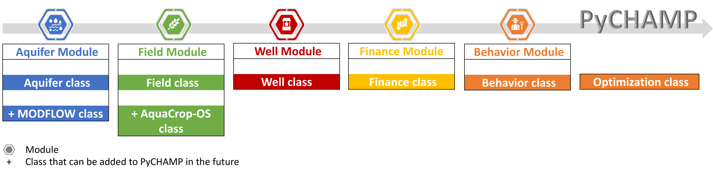
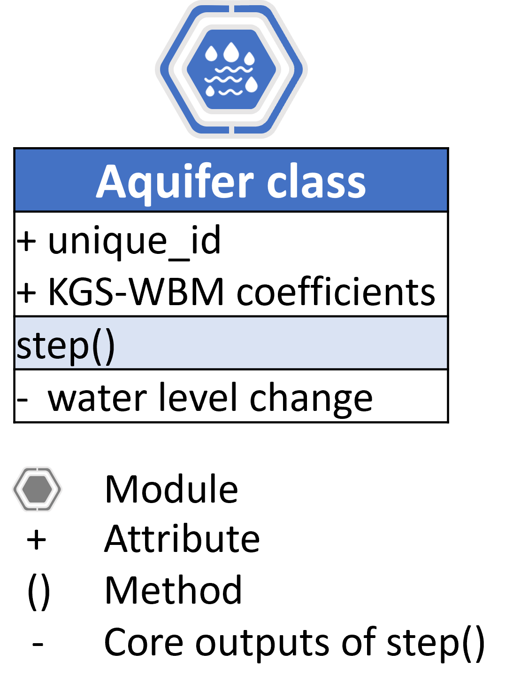
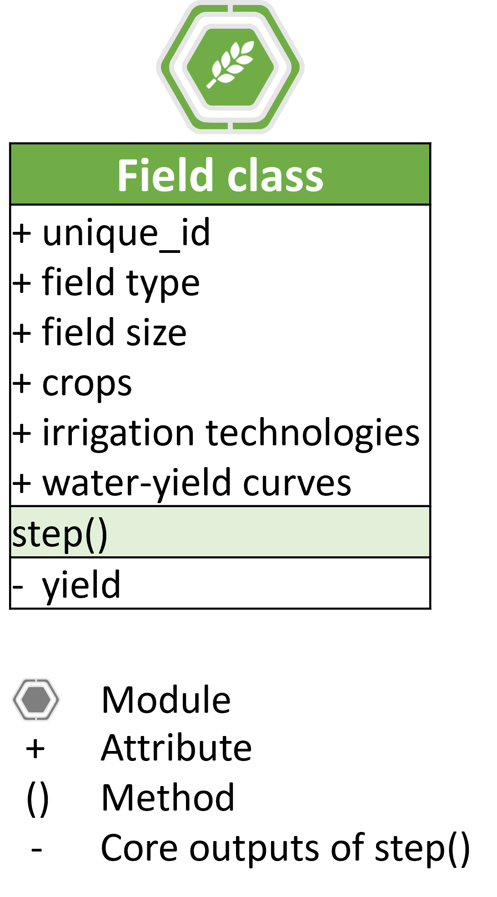
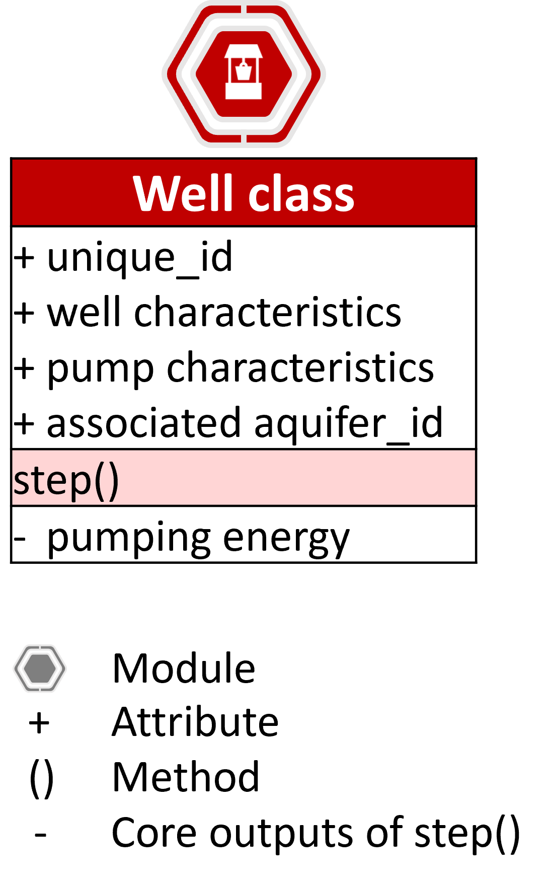
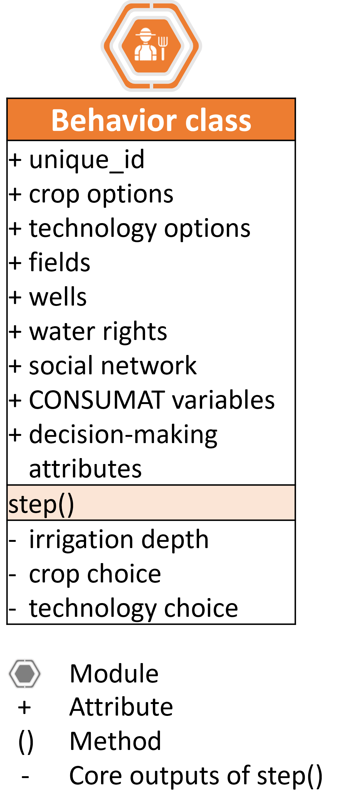
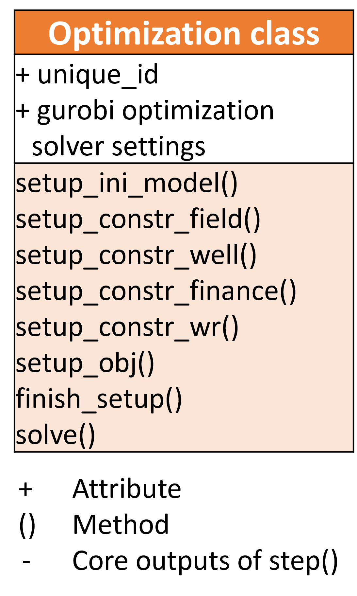

.. _general_intro:  

#################################
Introduction to the PyCHAMP Package
#################################
The Crop-Hydrological-Agent Modeling Platform, or PyCHAMP, is a free and open-source Python package. This initiative aims to facilitate the modeling of agro-hydrological systems for sustainable groundwater management.

PyCHAMP Features
================

* PyCHAMP is built on the MESA Agent-Based Modeling (ABM) framework.
* The package utilizes a modular approach, enhancing its adaptability to meet the diverse requirements of users.
* It currently includes five specific modules: aquifer, field, well, finance, and behavior, along with six main classes: aquifer, field, well, finance, behavior, and decision-making.

PyCHAMP Applications
====================

* PyCHAMP facilitates mapping of the dynamic interactions between human activities and water systems.
* The platform provides a framework for evaluating self-managed groundwater governance systems.
* PyCHAMP's design for expandability facilitates uncertainty analysis within the model's framework. This feature opens up possibilities for future integration with process-based models such as MODFLOW and AquaCrop-OS.

PyCHAMP Modules and Classes
===========================

   Illustration of versatility of PyCHAMP classes   

The upcoming section offers an overview of the PyCHAMP modules and their respective classes.

1. Aquifer Module
-----------------

Aquifer Class:
^^^^^^^^^^^^^^

Contained within the aquifer module, the aquifer class:

* simulates yearly fluctuations in groundwater levels using the Kansas Geological Survey – Water Balance Method (KGS-WBM);
* calculates and returns the annual change in water level (m).

   Illustration of simplified version of Aquifer class  

For a detailed description of the aquifer module, please see to :ref:`py_champ_entities_aquifer`.

2. Field Module 
---------------

Field Class:
^^^^^^^^^^^^

The field class inside the field module:

* employs a water-yield curve to simulate annual crop growth;
* calculates the annual yield for each crop type, crucial for revenue calculation in the finance module;
* determines the daily pumping rate needed for energy consumption calculations in the well module;
* updates the irrigation technology and crop type at each time step;
* returns the total yield in bushels per hectare (bu/ha), the yield rate per field (bu/ha), and the annual volume of irrigation (m-ha) used by the field.

   Illustration of simplified version of Field class  

For a comprehensive overview of the field module, please refer to :ref:`py_champ_entities_field`.

3. Well Module 
---------------

Well Class:
^^^^^^^^^^^^

The well module has a well class, which:

* calculates the total effective annual lift, essential for determining the well's annual energy requirements;
* returns the yearly energy usage of each well in petajoules (PJ).

   Illustration of simplified version of Well class  

For detailed insights into the well module, refer to :ref:`py_champ_entities_well`.

4. Finance Module 
---------------

Finance Class:
^^^^^^^^^^^^^^

Within the finance module, the finance class: 

* calculates the yearly revenue, which is the aggregate yield from all fields a farmer agent possesses, adjusted by the effective crop price—this price reflects the gross amount after deducting the production costs from the selling price of the crops;
* determines the profit by subtracting the expenses related to well energy usage, operation and maintenance of technology, and the costs for crop and irrigation technology changes from the overall revenue;
* returns  the profit in units of ten thousand dollars (1e4 $), an essential indicator for measuring farmer satisfaction.

.. figure:: Finance.png
   :align: center
   :width: 200px
   :alt: alternative text

   Illustration of simplified version of Finance class  

For additional information on the finance module, refer to :ref:`py_champ_entities_finance`.

5. Behavior Module 
---------------

Behavior Class:
^^^^^^^^^^^^^^^

The Behavior class in the behavior module:

* simulates a farmer's decision-making process based on the CONSUMAT framework; 
* performs several key operations as follows:

    a. It assesses perceived risk for each crop in various fields, using specified risk parameters.
    b. It updates the perceived precipitation levels, integrating forecasted values, the farmer's confidence in these forecasts, and the previously assessed risk.
    c. It executes simulations for the well, field, and finance modules for a single timestep, mirroring the farmer's current CONSUMAT state, and adjusts the CONSUMAT state for the next step based on updated satisfaction and uncertainty levels.
    d. Depending on the prevailing CONSUMAT state, it solves an optimization problem within the Optimization class and updates the decision-making solutions (referred to as dm_sols in the package), which will inform the agent’s actions in future time steps.
    e. It compares the agent's satisfaction levels with those of their network peers to solve the optimization problem when the agent’s CONSUMAT state involves social comparison or imitation.

* stores the decision-making outcomes as a dictionary for subsequent analysis. For example, the irrigation depth stored in the dictionary is utilized to compute the irrigation volume for each field, which, when aggregated for all fields owned by a farmer, determines the total water extraction from the aquifer within the simulated model.

   Illustration of simplified version of Behavior class  

For further insights into the behavior module, refer to :ref:`py_champ_entities_behavior`.

6. Optimization Class 
----------------------
The Optimization class:

* solves a non-linear mixed integer optimization problem annually using the Gurobi solver; 
* makes critical decisions about crop type selection, irrigation technologies, and irrigation options (rainfed or irrigated fields) for a farmer agent, in line with the agent's current CONSUMAT state; 
* executes several critical tasks as follows:

    a. It prepares the initial setup for the optimization problem, sourcing parameters from user inputs for the five mentioned classes. If any user inputs is missing, the class substitutes them with default values.
    b. It establishes constraints for all fields under the farmer's ownership through iteration. The decision variables such as crop type, irrigation technology, and the choice between irrigated or rainfed cultivation may be user-specified or optimized for each field, depending on the farmer's CONSUMAT state.
    c. It formulates constraints for every well operated by the farmer, with each iteration calculating the well's drawdown and energy consumption.
    d. It arranges the financial constraints for the farmer agent, based on the finance input dictionary to set parameters for revenue, energy costs, and other yearly expenses, including costs for changing crops and technologies, as well as annual technology operation fees.
    e. It iteratively imposes water rights constraint for the farmer agent.
    f. It delineates the objective for the optimization, aiming to maximize satisfaction based on the target variable specified in the behavior settings dictionary.
    g. Finally, it concludes the setup, solves the optimization problem while considering all constraints, and records the solutions within a dictionary.
    
* informs the behavior class within the package to update the CONSUMAT state of the farmer agent through the solution dictionary.

   Illustration of simplified version of Optimization class  

For further insights into the optimization class, refer to :ref:`py_champ.entities.optimization`.

General Structure of an agent based model based on PyCHAMP
==========================================================

PyCHAMP utilizes the Mesa 2.1.1 Agent-Based Modeling (ABM) framework. For a detailed understanding of how to build, analyze, and visualize agent-based models using the Mesa framework, refer to https://mesa.readthedocs.io/en/latest/overview.html.

PyCHAMP initiates by defining a MyModel class, which is an extension of mesa.Model. A new instance of this model is created, taking various input dictionaries as parameters. Within the newly created instance of the class, different agents like aquifer, field, well, finance, and behavior, each based on their respective input dictionaries are initialized. It is important to note the flexibility in the number of agent instances; for example, there can be multiple instances of well agents, ranging from 1 to n. Upon initialization, these agents are added to the Mesa scheduler. Additionally, within the __init__ method of MyModel, a DataCollector is set up to gather and record both model-level and agent-level data during the simulation.

The model includes a step method to progress the simulation by one time unit. This method updates the attributes of the agents and specifically advances the state of the Behavior agent type through the Mesa scheduler. In a unique setup, other agent types are simulated within the Behavior agent. The aquifer agents are then iteratively processed to calculate the total annual water withdrawal, aggregating the withdrawal from each well. The withdrawal for each aquifer is then updated within the step method of the aquifer class. Additionally, the step method directs the previously initialized DataCollector to capture and store data related to the various agents.

To run the simulation, a model object is instantiated with the necessary input settings dictionaries, and the step method is called repeatedly for the desired number of iterations.

The general structure of a Model created with PyCHAMP modules is illustrated below:

.. code-block:: python

    class MyModel(mesa.Model):
        def __init__(self, settings):
            # Initialize scheduler.
            self.schedule = mesa.time.Scheduler(self)
            
            # For agent initialization and scheduling use for loop if you have more than one agent under each agent type.

            # Initialize all aquifer agents with settings. 
            agent_aquifer = Aquifer(settings)
            # Add all aquifer agents to the scheduler.
            self.schedule.add(agent_aquifer)

            # Initialize all field agents with settings.
            agent_field = Field(settings) 
            # Add all field agents to the scheduler.
            self.schedule.add(agent_field)

            # Initialize all well agents with settings.
            agent_wells = Wells(settings)
            # Add all well agents to the scheduler.
            self.schedule.add(agent_wells)

            # Initialize a finance agent for each behavior agent with settings.
            agent_finance = Finance(settings)
            # Add all finance agents to the scheduler.
            self.schedule.add(agent_finance)

            # Initialize all behavior agents with settings.
            agent_behavior = Behavior(settings)
            # Add all behavior agents to the scheduler.
            self.schedule.add(agent_behavior)
  
            # Initialize DataCollector for storing model-level and agent-level data.
            self.datacollector = mesa.DataCollector(model_reporters, agent_reporters) 

        def step(self):
            # Update crop crop prices.
            if crop_price_step is not None: 
                crop_price = crop_price_step[self.current_year] # The crop price for each time step is retrived from crop_price_step, given as an input to the finance dictionary. Loop through each finance id if you have more than one.

            # Update the raifed or irrigated field type.
            for each_behavior_agent in agent_behavior:
                randomly select rainfed or optimize option for each field

            # Turn on water right status from the appropriate time step, if applicable. 
            if self.water_right and current_year >= self.water_right_year:
            water_right_dictionary['status'] = True
            
            # Call the scheduler to update Behavior agents.
            self.schedule.step(agent_type = "Behavior") 
            
            # Calculate total annual withdrawal for all aquifers and update withdrawal.
            for each_aquifer_agent in agent_aquifer:
                calculate total annual withdrawal
                aquifer_agent.step(withdrawal) # Call the step method of aquifer_agent to update the withdrawal information.
            
            # Collect model and agent data.
            self.datacollector.collect(self) 

    # Initialize a new instance of MyModel with settings.
    model_instance = MyModel(settings)

    # Run the simulation for the requird number of steps.
    for _ in range(simulation_steps):
        model_instance.step()